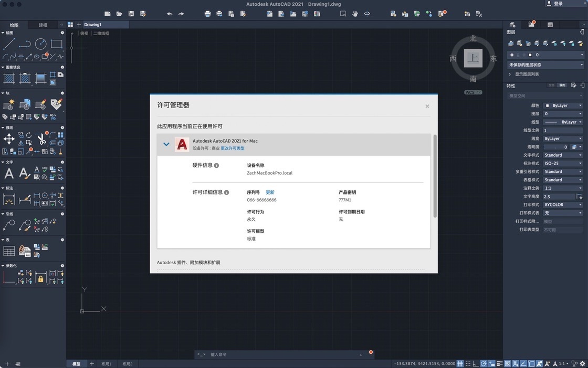
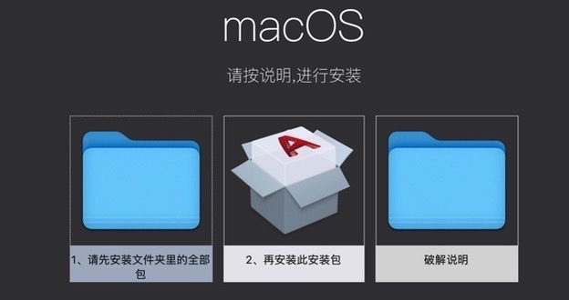
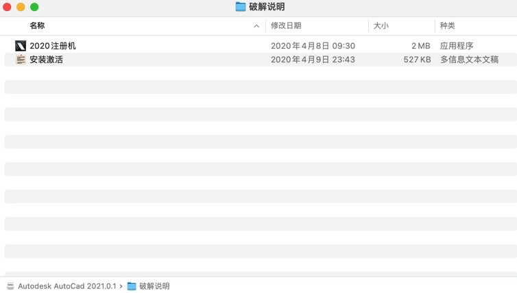

# autodesk-autocad-2021 安装以及破解流程

 获取安装包 [软件安装包地址](https://alumnialbany-my.sharepoint.com/:f:/g/personal/zachchan_alumni_albany_edu/EiCxdujfS8lNgGRWCvkgn50BiZgf7DTlvPj1QsnkhhstPQ?e=B7j0MI)
1. 安装包路径以及安装说明
    
    * 打开Autodesk AutoCAD 2021R.46.M1748.dmg
        * 安装流程说明
            * 
                * 按照图示流程先安装文件夹 1 内的所有文件，接着安装2，等待安装完成进度条走完 
    * 打开更新包直接安装2，等待更新进度完成
2. 破解前的设置
    *   进入【应用程序】文件夹，然后单击【Autodesk】
    *   然后在其中的【Adlm】将看到2个文件夹，名称为R20，另一个名称为R15
    *   将R20重命名为R19，将文件夹R15重命名为R20 
3. 破解激活流程（中文版安装流程同理，自行翻译即可）
    * （1）mac进行断网
    * （2）打开AutoCAD 2021
    * （3）点击进入【enter a serial number/输入序列号】，（如果点击后弹出一个小窗口system settings error的话点击【activate the license】，没有请忽略）
    * （4）点击【I Agree】，再点击【Activate】
    * （5）进入AutoCAD 2021 激活界面，输入Serial Number序列号和Product Key，输入后，点击【下一步】
        * 
```
Serial Number：666-69696969, 667-98989898, 400-45454545 066-66666666
（序列号任选一个填写即可）
2019 AutoCAD Product Key: 001K1
2021 AutoCAD Product Key: 777M1
2021 SketchBook Pro Product Key: 871M1
2020 Autodesk Maya Product Key: 923L1
```
    * （6）点击【next】，点击【close】
    * （7）关闭AutoCAD 2021 重新打开
    * （8）点击【Activate】，重复第（5）步的操作，点击【Next】后会生成你的 Request code，选中使用command + c复制
    * （9）打开破解说明，打开2020注册机
        *   
        * 若提示无权限打开，查看解决方案[关于Big Sur没有权限打开应用程序的解决方法](https://zhuanlan.zhihu.com/p/331816664)    

    * （10）点击【Mem Patch】，输入电脑 开机密码，弹出Success窗口点击【OK】
    *  （11）将第 （8）步复制的Request Code粘贴到注册机的Request Code处，然后点击【Generate】生成激活码
     *  
```粘贴要先将输入框的文本删掉，然后在输入框中右键，
点击Paste，如果粘贴后无反应，试着按键盘上的左键头，
还不行就只能手动输入了。
如果出现【Bad Activation code】
一定是粘贴的 Request code 有多余的字符，请认真检查。
```   
 *  （12）将生成的 【Activation Code】复制到对应区域，点击【Next】
     * 
 ```如果提示激活码无效，那么就返回第 （8）步,
 重新选一个Serial Number，再操作一遍就可以了。
```   
 *  （13）激活完成，尽情享用吧！（如果弹出Processing Error，点击Close即可）

   
      
    
       

        